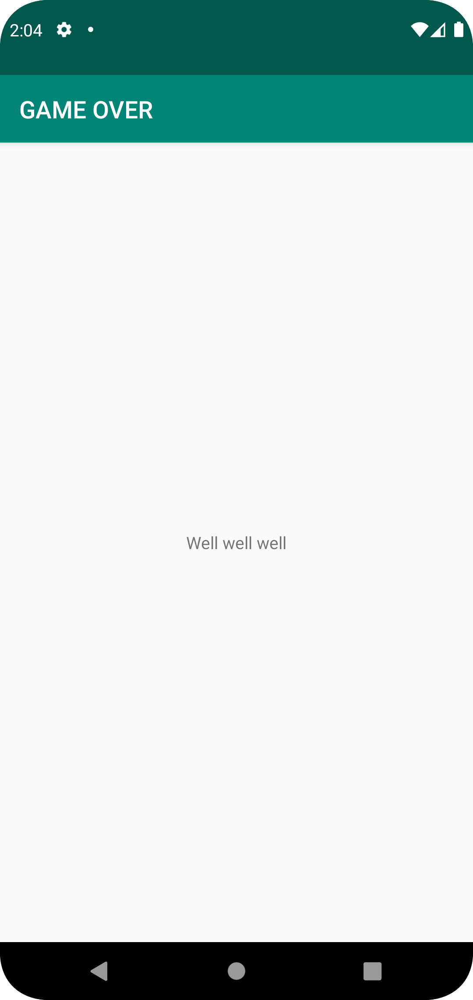

# Rapport
Innuti string.xml så ändrade jag valuet i variablen "app_name" till "Well well well <br />
samt som det skapades en ny string med namnet "text_field" och innehållet "GAME OVER"  <br />
Värderna innuti AndroidManifest.xml vart app_name tidigare var ändrades till "text_field"  <br />

Screenshot togs av startsidan och lades i mappen screenshot

```
string.xml
<resources>
    <string name="app_name">Well well well</string>
    <string name="text_field">GAME OVER</string>
</resources>

```
.


